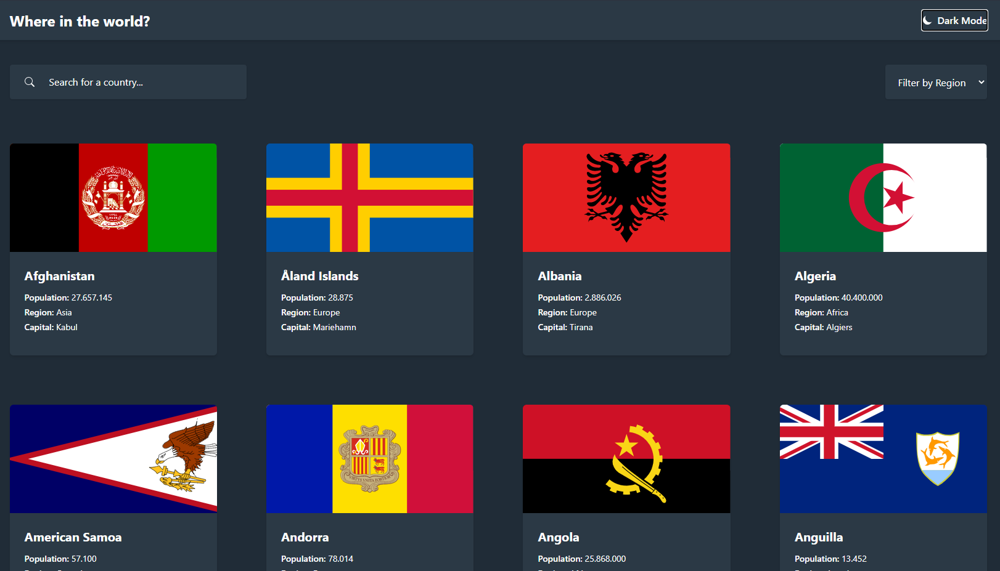

<h1 align="center">
  REST Countries API with color theme switcher
</h1>

<h3 align="center">
<strong>Project based on <a href="https://www.frontendmentor.io/challenges/rest-countries-api-with-color-theme-switcher-5cacc469fec04111f7b848ca" target="_blank">Frontend Mentor Challenge </a></strong>
</h3>

  
  
  
  
   
   
  <a href="#space_invader-technologies">Technologies</a>
   
   
  
   
  <a href="https://shiga-countries-list.vercel.app/" target="_blank">
    <h3 align="center"><b>VISIT</b></h3>
  </a>
   

## :space_invader: Technologies

- [NextJS](https://nextjs.org/)
- Typescript
- [React icons](https://react-icons.github.io/react-icons/)
- [nextjs-progressbar](https://github.com/apal21/nextjs-progressbar)
- [Next SEO](https://github.com/garmeeh/next-seo)
- [Tailwind CSS](https://tailwindcss.com/)
- [REST Countries](https://restcountries.eu/)
